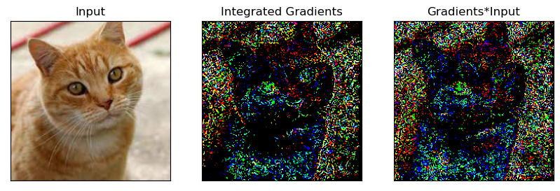
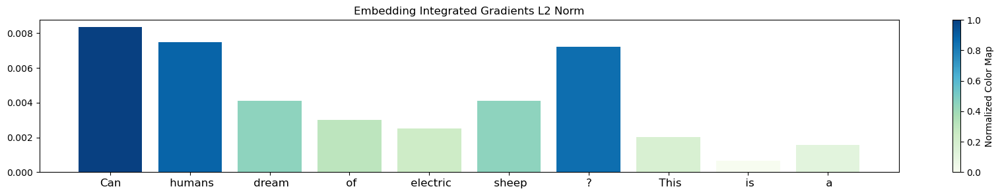
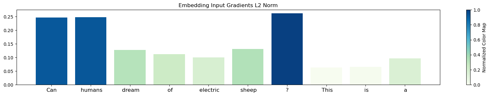

# Neural Network Diagnostics
Debugging tools for pytorch neural networks

<figure>

<figcaption align = "center"><b>Fig.1 - Image classification (Resnet) diagnostics using integrated gradients and input gradients, model prediction label is "tiger cat". </b></figcaption>
</figure>

<figure>

<figcaption align = "center"><b>Fig.2 - Language modeling (GPT2) diagnostics using integtated gradients, the input text is "Can humans dream of electric sheep ? This is a", next token prediction is "question".</b></figcaption>
</figure>

<figure>

<figcaption align = "center"><b>Fig.3 - Language modeling (GPT2) diagnostics using input gradients, with same input and prediction.</b></figcaption>
</figure>

### Methods:
- [Input Gradients](diagnostics/input_gradients.py), analog of the model coefficients for a deep network.
- [Integrated Gradients](diagnostics/input_gradients.py), "Axiomatic Attribution for Deep Networks", Mukund Sundararajan Ankur Taly, Qiqi Yan [[paper]](https://arxiv.org/abs/1703.01365) [[original implementation]](https://github.com/ankurtaly/Integrated-Gradients).

### Demos

- [ConvNets](notebooks/demo_cnn.ipynb)
- [GPT2 LM](notebooks/demo_lm.ipynb)

### Environment setup

- [Anaconda](https://www.anaconda.com/), for python package management.

```
    conda env create -f environment.yaml
    conda activate nn-diagnostics
```

- [direnv](https://direnv.net/), optional, used for automatic setup environment when changing directory.

### Contribute

- Install pre-commit hooks

```
    pre-commit install
```
